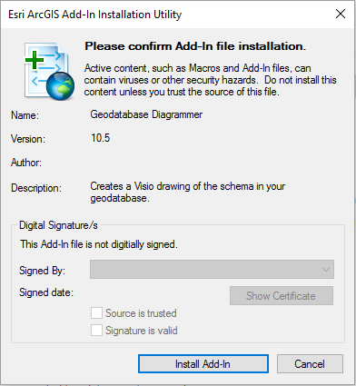
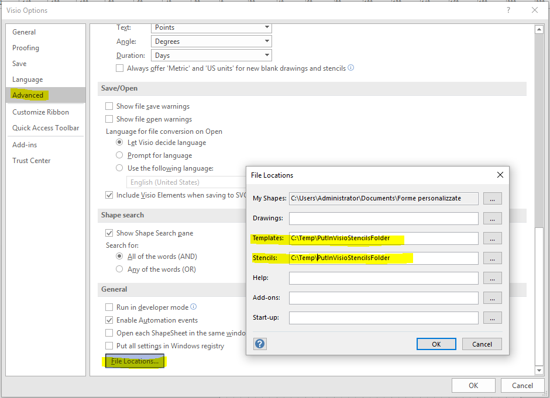
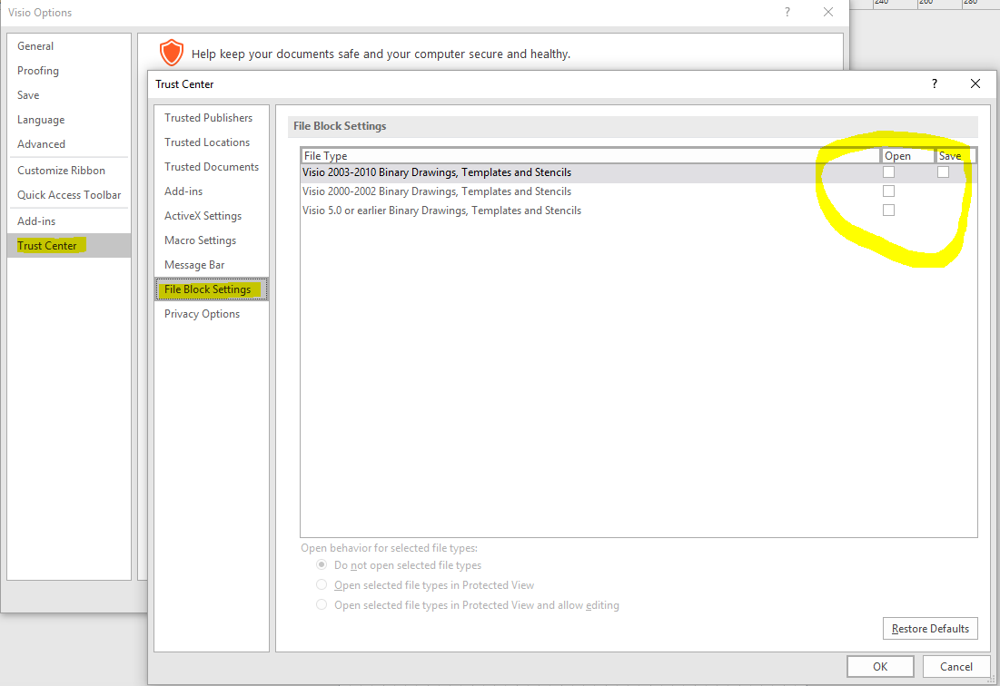
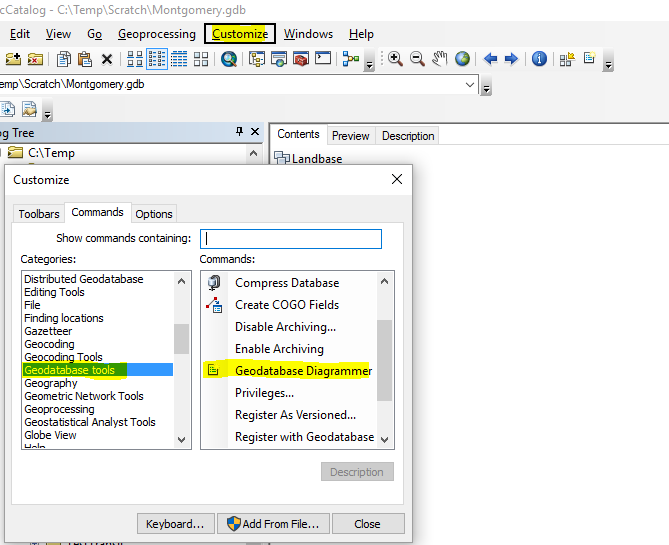
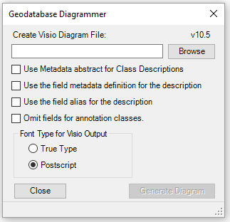
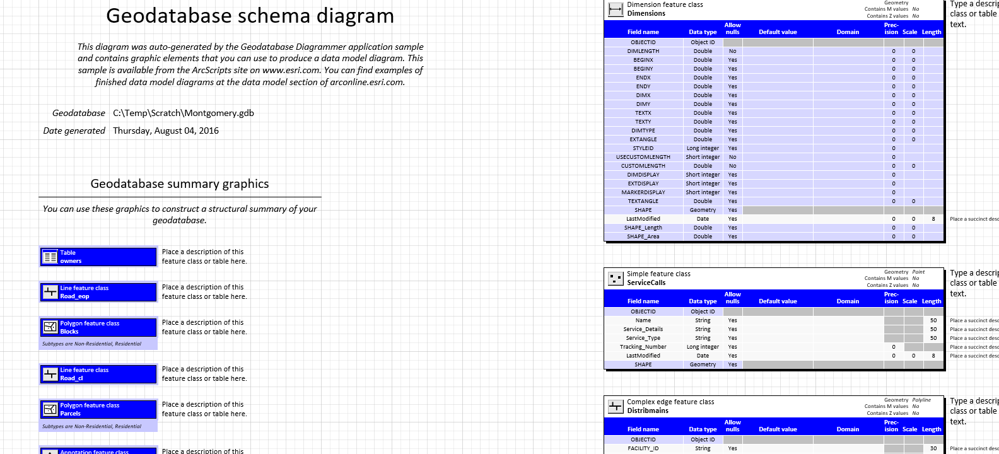

### Geodatabase Diagrammer for ArcGIS for Desktop

#### Description
This will create a Visio diagram showing the classes and their schema in a geodatabase of your choosing. Use this tool to create a data model poster.
This code was originally produced by ESRI (Richie Carmichael and Michael Zeiler) in 2002 for version 8.3.
The link is [http://www.arcgis.com/home/item.html?id=a378b48be11b45b5bb25254643304cb7](http://www.arcgis.com/home/item.html?id=a378b48be11b45b5bb25254643304cb7).
I only have recompiled for ArcGIS 10.5 and Visio Pro 2016-2019 32bit

#### System Requirements

- ArcGIS Desktop version 10.5 or superior
- Microsoft Visio Pro 2016-2019 32bit
- .NET 4.5 Framework

#### Limitations
This application does not support exotic custom feature class types. The types that are supported are:

- Point (including multipoint), Line/Polyline, Polygon
- Annotation
- Dimension
- Network (simple or complex edges and junctions)

#### Setup
- Download from https://github.com/nicogis/Geodatabase-Diagrammer/releases
- Unzip …
- Close ArcCatalog if open.
- Double‐click the file “GeodatabaseDiagrammer.esriAddIn”. 

- Click “Install Add‐In”.
- Click OK in the small notification dialog.
- There are some custom templates (*.vst) and stencil (*.vss) files that the Diagrammer needs
which are located in PutInVisioStencilsFolder. Choose a permanent location on
your computer for these files and copy them there.
- Open MS Visio.
- Select Options under File.
- Click the Advanced tab.
- Click “File Paths” button.
- Indicate the folder locations next to Templates and Stencils as shown below.

Click Trust Center.
Click Trust Center Settings
Click File Block Settings
Untick Boxes in File Block Settings 

- Open ArcCatalog.
- Click on the Customize menu and select Customize – Toolbars.
- Click the Commands tab.
- Select Geodatabase tools under the Categories list.
- Click on the Geodatabase Diagrammer under the Commands list. Hold and drag it up onto an
existing toolbar in ArcCatalog.

- Click the Close button on the Customize Dialog.

#### Use

- Open ArcCatalog.
- Select a geodatabase in the TOC.
- Click the Geodatabase Diagrammer button.

- Click browse to indicate the output Visio diagram file that you will be creating.
- Use the other options on the form as desired.
- Click Generate Diagram.
The Status bar at the bottom of the form will show messages as the diagram is being created.
When it is finished it will read “Completed the diagram”.
- Click Close to close the form.
- Browse to the Visio (.vsd) output file and double‐click it to open it.

